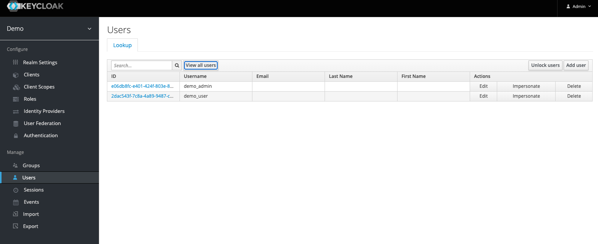
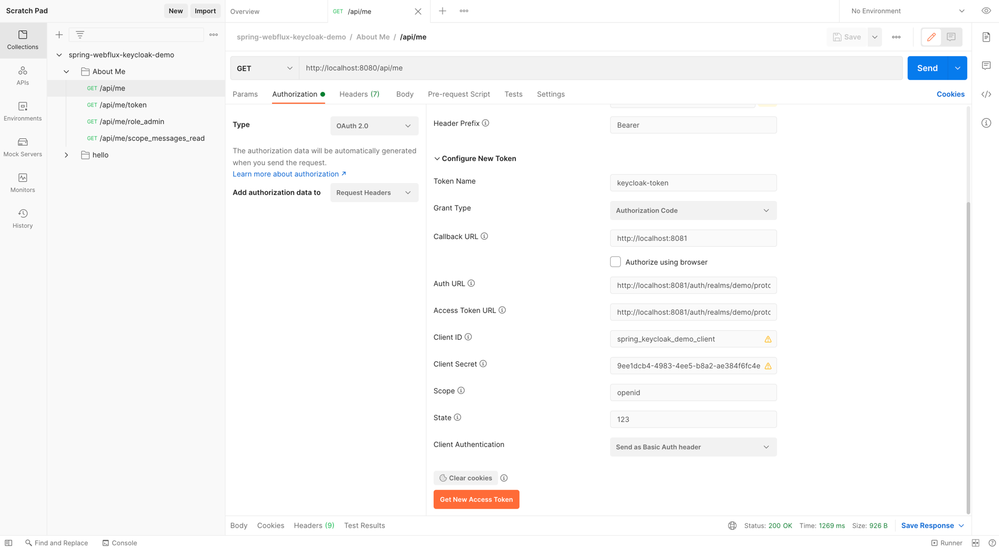

# Spring oauth2 webflux application integrated with Keycloak and Spring Security 5 (demo)

This repository contains reactive **resource server** application that integrates with Keycloak.

Keycloak server with all components can be started using [docker-compose](./docker/docker-compose.yml) and [utility script](./docker/setupDemoRealm.sh).

## Features

* OAuth2 resource server.
* Keycloak integration.
* Reactive method security.
* Reactive test support.
* Wiremock integration.  
* Automated script for creation of `demo` realm.
* Postman collection with Oauth2 setup.

## Getting Started

### Prerequisite

* Java 11
* Docker
* Docker-Compose

### Usage

* Start docker compose (keycloak and postgres)
  ```shell
  cd docker
  
  docker-compose up -d
  ```
  
* Check if all services started.
  ```shell
  docker-compose ps   

  # Name                     Command               State                Ports
  # ---------------------------------------------------------------------------------------------
  # docker_keycloak_1   /opt/jboss/tools/docker-en ...   Up      0.0.0.0:8081->8080/tcp, 8443/tcp
  # docker_postgres_1   docker-entrypoint.sh postgres    Up      5432/tcp
  ```
  
* Open your web browser and go to Keycloak [login page](http://localhost:8081/). On the login page, enter `admin` for a username and password.

* Start creation script for `demo` realm.
  ```shell
  sh setupDemoRealm.sh
  
  # Starting creation of demo realm. Your clientId: spring_keycloak_demo_client clientSecret: 9ee1dcb4-4983-4ee5-b8a2-ae384f6fc4e5
  # Logging into http://localhost:8080/auth as user admin of realm master
  # Created new realm with id 'demo'
  # Created new client-scope with id '706cd55d-0c22-4596-bdfe-ee9e35bc5c73'
  # Created new client with id '619b7a78-61eb-4d98-8bce-0b85801d36f6'
  # Created new role with id 'ROLE_USER'
  # Created new role with id 'ROLE_ADMIN'
  # Created new user with id '2dac543f-7c8a-4a89-9487-c054f03a2a5b'
  # Created new user with id 'e06db8fc-e401-424f-803e-8191abe8857c'
  ```

* Verify that `demo` realm and users exist in Keycloak.
  

* Start resource server.
  ```shell
  ./gradlew bootRun
  ```
  
* Import postman collection (`demo.postman_collection.json`).

* Get the OAuth Access Token from Postman.
  
  
* Use **demo_user/demo_user** or **demo_admin/demo_admin** credentials inside Keycloak login popup.

* Play with API.

* Stop demo and cleanup volumes.
  ```shell
  docker-compose down -v
  ```

## Additional tips

### Record stub mappings using WireMock

* Download wiremock-standalone.jar e.g. https://repo1.maven.org/maven2/com/github/tomakehurst/wiremock-standalone/2.27.2/wiremock-standalone-2.27.2.jar

* Start WireMock in a proxy mode to record calls to Keycloak.
  ```shell
  java -jar wiremock-standalone-2.27.2.jar --record-mappings --proxy-all="http://localhost:8081"
  ```

* Recorded mappings can be found inside **mappings** and **__files**. These recordings can be useful for integration testing e.g. [HelloControllerTest](./src/test/java/com/rbiedrawa/oauth/web/HelloControllerTest.java)

## References

* [Spring Webflux Oauth2](https://docs.spring.io/spring-security/site/docs/5.2.0.M2/reference/html/webflux-oauth2.html)
* [EnableReactiveMethodSecurity - Spring Security Documentation](https://docs.spring.io/spring-security/site/docs/5.1.1.RELEASE/reference/html/jc-erms.html)
* [Reactive Test Support](https://docs.spring.io/spring-security/site/docs/5.1.1.RELEASE/reference/html/test-webflux.html)
* [jwt.io](https://jwt.io/)
* [Use Postman to test API calls](https://developer.mypurecloud.com/api/rest/postman/index.html#enable_authorization)
* [Explain it to Me Like I’m 5: Oauth2 and OpenID](https://www.youtube.com/watch?v=5th6CSQTdpM)
* [How to secure your Spring apps with Keycloak by Thomas Darimont @ Spring I/O 2019](https://www.youtube.com/watch?v=KrOd5wIkqls)

## License

Distributed under the MIT License. See `LICENSE` for more information.
